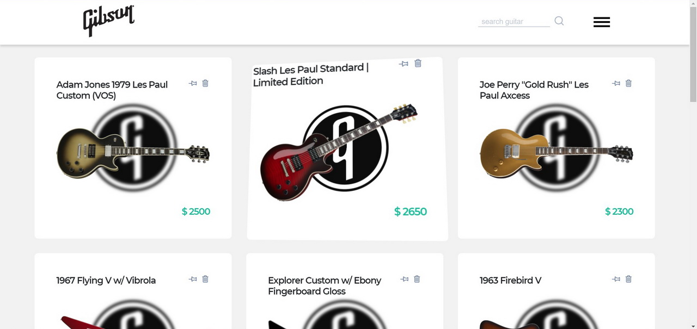

# Gibson guitars - product list
Product list app in React/Redux/Firebase. User can add, remove or pin selected item. Pinned item appears first in the list. Only one pinned item allowed. To store product image, firebase storage is used. To store products, firestore is used.

## Libraries and dependencies used

- [React](https://reactjs.org/)
- [Redux](https://redux.js.org/)
- [React Redux](https://react-redux.js.org/)
- [Redux Thunk](https://github.com/reduxjs/redux-thunk)
- [Reselect](https://github.com/reduxjs/reselect)
- [Firebase](https://github.com/firebase/)
- [Formik](https://formik.org/)
- [react-spinners](https://www.npmjs.com/package/react-spinners)
- [nano Id](https://github.com/ai/nanoid)
- [Lodash](https://lodash.com/)